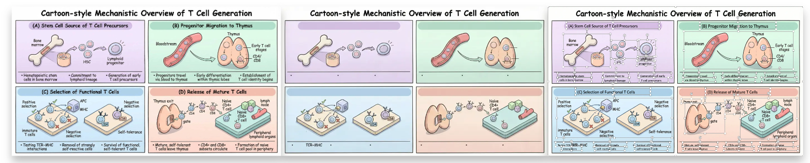

<div align="center">


# Paper2Any

[](https://www.python.org/)
[](LICENSE)
[](https://github.com/OpenDCAI/Paper2Any)
[](https://github.com/OpenDCAI/Paper2Any/stargazers)

English | [中文](README.md)

✨ **Focus on paper multimodal workflows: from paper PDFs/screenshots/text to one-click generation of model diagrams, technical roadmaps, experimental plots, and slide decks** ✨

| 📄 **Universal File Support** &nbsp;|&nbsp; 🎯 **AI-Powered Generation** &nbsp;|&nbsp; 🎨 **Custom Styling** &nbsp;|&nbsp; ⚡ **Lightning Speed** |

<br>

<a href="#-quick-start" target="_self">
  
</a>
<a href="http://dcai-paper2any.nas.cpolar.cn/" target="_blank">
  
</a>
<a href="docs/" target="_blank">
  
</a>
<a href="docs/contributing.md" target="_blank">
  
</a>
<a href="#wechat-group" target="_self">
  
</a>

<br>
<br>


</div>

---

## 📢 Roadmap & Split Announcement

> [!IMPORTANT]
> **This project is undergoing an architectural split to provide a more focused feature experience.**

- **[Paper2Any](https://github.com/OpenDCAI/Paper2Any)** (this repo):
  - Focuses on paper multimodal workflows (Paper2Figure, Paper2PPT, Paper2Video, etc.).
  - Provides one-click tools for scientific plotting, PPT generation, and video script assistance for researchers.

- **[DataFlow-Agent](https://github.com/OpenDCAI/DataFlow-Agent)** (new repo):
  - Focuses on DataFlow operator orchestration and authoring.
  - Provides a general-purpose multi-agent dataflow processing framework and operator development toolkits.

---

## 📑 Table of Contents

- [🔥 News](#-news)
- [✨ Core Features](#-core-features)
- [📸 Showcase](#-showcase)
- [🚀 Quick Start](#-quick-start)
- [📂 Project Structure](#-project-structure)
- [🗺️ Roadmap](#️-roadmap)
- [🤝 Contributing](#-contributing)

---

## 🔥 News

> [!TIP]
> 🆕 <strong>2026-01-14 · Feature Updates & Backend Architecture Upgrade</strong><br>
> 1. **Feature Updates**: Added **Image2PPT**, optimized **Paper2Figure** interaction, and improved **PDF2PPT** effects.<br>
> 2. **Standardized API**: Refactored backend interfaces with RESTful `/api/v1/` structure, removing obsolete endpoints for better maintainability.<br>
> 3. **Dynamic Configuration**: Supported dynamic model selection (e.g., GPT-4o, Qwen-VL) via API parameters, eliminating hardcoded model dependencies.<br>
> 🌐 Online Demo: <a href="http://dcai-paper2any.nas.cpolar.cn/">http://dcai-paper2any.nas.cpolar.cn/</a>

- 2025-12-12 · Paper2Figure Web public beta is live
- 2025-10-01 · Released the first version <code>0.1.0</code>

---

## ✨ Core Features

> From paper PDFs / images / text to **editable** scientific figures, slide decks, video scripts, academic posters, and other multimodal content in one click.

Paper2Any currently includes the following sub-capabilities:

- **📊 Paper2Figure - Editable Scientific Figures**: One-click generation of model architecture diagrams, technical roadmaps (PPT + SVG), and experimental plots. Supports multiple input sources and outputs editable PPTX.
- **🎬 Paper2PPT - Editable Slide Decks**: Generate PPTs in arbitrary styles, support ultra-long document processing, and include built-in table extraction and chart parsing.
- **🖼️ PDF2PPT - Layout-Preserving Conversion**: Intelligent cutout and layout analysis to accurately convert PDFs into editable PPTX.
- **🎨 PPT Smart Beautification**: AI-based PPT layout optimization and style transfer.

---

## 📸 Showcase

### 📊 Paper2Figure: Scientific Figure Generation

<div align="center">

<br>

<br><sub>✨ Model Architecture Diagram Generation</sub>

<br>

<br><sub>✨ Model Architecture Diagram Generation</sub>

<br><br>

<br><sub>✨ Technical Roadmap Generation</sub>

<br><br>

<br><sub>✨ Experimental Plot Generation (Multiple Styles)</sub>

</div>

---

### 🎬 Paper2PPT: Paper to Presentation

<div align="center">

<br>

<br><sub>✨ PPT Generation Demo</sub>

<br>

<br><sub>✨ Paper / Text / Topic → PPT</sub>

<br><br>

<br><sub>✨ Long Document Support (40+ Slides)</sub>

<br><br>

<br><sub>✨ Intelligent Table Extraction & Insertion</sub>

</div>

---

### 🎨 PPT Smart Beautification

<div align="center">

<br>

<br><sub>✨ AI-based Layout Optimization</sub>

<br>

<br><sub>✨ AI-based Layout Optimization & Style Transfer</sub>

</div>

---

### 🖼️ PDF2PPT: Layout-Preserving Conversion

<div align="center">

<br>

<br><sub>✨ Intelligent Cutout & Layout Preservation</sub>

<br>

<br><sub>✨ Image2PPT</sub>

</div>

---

## 🚀 Quick Start

### Requirements


### 🐧 Linux Installation

> We recommend using Conda to create an isolated environment (Python 3.11).  

#### 1. Create Environment & Install Base Dependencies

```bash
# 0. Create and activate a conda environment
conda create -n paper2any python=3.11 -y
conda activate paper2any

# 1. Clone repository
git clone https://github.com/OpenDCAI/Paper2Any.git
cd Paper2Any

# 2. Install base dependencies
pip install -r requirements-base.txt

# 3. Install in editable (dev) mode
pip install -e .
```

#### 2. Install Paper2Any-specific Dependencies (Required)

Paper2Any involves LaTeX rendering, vector graphics processing as well as PPT/PDF conversion, which require extra dependencies:

```bash
# 1. Python dependencies
pip install -r requirements-paper.txt || pip install -r requirements-paper-backup.txt

# 2. LaTeX engine (tectonic) - recommended via conda
conda install -c conda-forge tectonic -y

# 3. Resolve doclayout_yolo dependency conflicts (Important)
pip install doclayout_yolo --no-deps

# 4. System dependencies (Ubuntu example)
sudo apt-get update
sudo apt-get install -y inkscape libreoffice poppler-utils wkhtmltopdf
```

#### 3. Environment Variables

```bash
export DF_API_KEY=your_api_key_here
export DF_API_URL=xxx  # Optional: if you need a third-party API gateway
export MINERU_DEVICES="0,1,2,3" # Optional: MinerU task GPU resource pool
```

#### 4. Configure Supabase (Required for Frontend & Backend)

Create a `.env` file under the `frontend-workflow` directory and fill in the following configuration:

```bash
# frontend-workflow/.env

VITE_SUPABASE_URL=your_supabase_url
VITE_SUPABASE_ANON_KEY=your_supabase_anon_key

# Backend
SUPABASE_URL=your_supabase_url
SUPABASE_ANON_KEY=your_supabase_anon_key
SUPABASE_SERVICE_ROLE_KEY=your_service_role_key
SUPABASE_JWT_SECRET=your_jwt_secret

# Application Settings
DAILY_WORKFLOW_LIMIT=10
```

<details>
<summary><strong>Advanced Configuration: Local Model Service Load Balancing</strong></summary>

If you are deploying in a high-concurrency local environment, you can use `script/start_model_servers.sh` to start a local model service cluster (MinerU / SAM / OCR).

Script location: `/DataFlow-Agent/script/start_model_servers.sh`

**Main configuration items:**

- **MinerU (PDF Parsing)**
  - `MINERU_MODEL_PATH`: Model path (default `models/MinerU2.5-2509-1.2B`)
  - `MINERU_GPU_UTIL`: GPU memory utilization (default 0.2)
  - **Instance configuration**: By default, 4 instances are started on GPU 0 and GPU 4 respectively (8 in total), ports 8011-8018.
  - **Load Balancer**: Port 8010, automatically dispatches requests.

- **SAM (Segment Anything Model)**
  - **Instance configuration**: By default, 1 instance is started on GPU 2 and GPU 3 respectively, ports 8021-8022.
  - **Load Balancer**: Port 8020.

- **OCR (PaddleOCR)**
  - **Config**: Runs on CPU, uses uvicorn's worker mechanism (4 workers by default).
  - **Port**: 8003.

> Before using, please modify `gpu_id` and the number of instances in the script according to your actual GPU count and memory.

</details>

---

### 🪟 Windows Installation

> [!NOTE]
> We currently recommend trying Paper2Any on Linux / WSL. If you need to deploy on native Windows, please follow the steps below.

#### 1. Create Environment & Install Base Dependencies

```bash
# 0. Create and activate a conda environment
conda create -n paper2any python=3.12 -y
conda activate paper2any

# 1. Clone repository
git clone https://github.com/OpenDCAI/Paper2Any.git
cd Paper2Any

# 2. Install base dependencies
pip install -r requirements-win-base.txt

# 3. Install in editable (dev) mode
pip install -e .
```

#### 2. Install Paper2Any-specific Dependencies (Recommended)

Paper2Any involves LaTeX rendering and vector graphics processing, which require extra dependencies (see `requirements-paper.txt`):

```bash
# Python dependencies
pip install -r requirements-paper.txt

# tectonic: LaTeX engine (recommended via conda)
conda install -c conda-forge tectonic -y
```

**🎨 Install Inkscape (SVG/Vector Graphics Processing | Recommended/Required)**

1. Download and install (Windows 64-bit MSI): [Inkscape Download](https://inkscape.org/release/inkscape-1.4.2/windows/64-bit/msi/?redirected=1)
2. Add the Inkscape executable directory to the system environment variable Path (example): `C:\Program Files\Inkscape\bin\`

> [!TIP]
> After configuring the Path, it is recommended to reopen the terminal (or restart VS Code / PowerShell) to ensure the environment variables take effect.

#### ⚡ Install Windows Build of vLLM (Optional | For Local Inference Acceleration)

Release page: [vllm-windows releases](https://github.com/SystemPanic/vllm-windows/releases)  
Recommended version: 0.11.0

```bash
pip install vllm-0.11.0+cu124-cp312-cp312-win_amd64.whl
```

> [!IMPORTANT]
> Please make sure the `.whl` matches your current environment:
> - Python: cp312 (Python 3.12)
> - Platform: win_amd64
> - CUDA: cu124 (must match your local CUDA / driver)

#### Launch Application

**Paper2Any - Paper Workflow Web Frontend (Recommended)**

```bash
# Start backend API
cd fastapi_app
uvicorn main:app --host 0.0.0.0 --port 8000

# Start frontend (new terminal)
cd frontend-workflow
npm install
npm run dev
```

**Configure Frontend Proxy**

Modify `server.proxy` in `frontend-workflow/vite.config.ts`:

```typescript
export default defineConfig({
  plugins: [react()],
  server: {
    port: 3000,
    open: true,
    allowedHosts: true,
    proxy: {
      '/api': {
        target: 'http://127.0.0.1:8000',  // FastAPI backend address
        changeOrigin: true,
      },
    },
  },
})
```

Visit `http://localhost:3000`.

**Windows: Load MinerU Pre-trained Model**

```powershell
# Start in PowerShell
vllm serve opendatalab/MinerU2.5-2509-1.2B `
  --host 127.0.0.1 `
  --port 8010 `
  --logits-processors mineru_vl_utils:MinerULogitsProcessor `
  --gpu-memory-utilization 0.6 `
  --trust-remote-code `
  --enforce-eager
```

> [!TIP]
> **Paper2Figure Web Beta Instructions**
> 
> If you do not want to deploy both frontend and backend for now, you can try the core capabilities via local scripts:
> - `python script/run_paper2figure.py`: model architecture diagram generation
> - `python script/run_paper2expfigure.py`: experimental plot generation
> - `python script/run_paper2technical.py`: technical roadmap generation
> - `python script/run_paper2ppt.py`: paper to editable PPT
> - `python script/run_pdf2ppt_with_paddle_sam_mineru.py`: PDF2PPT (layout preserved + editable content)

---

### Launch Application

#### 🎨 Web Frontend (Recommended)

```bash
# Start backend API
cd fastapi_app
uvicorn main:app --host 0.0.0.0 --port 8000

# Start frontend (new terminal)
cd frontend-workflow
npm install
npm run dev
```

Visit `http://localhost:3000`.

> [!TIP]
> If you do not want to deploy frontend/backend for now, you can try the core features via local scripts:
> - `python script/run_paper2figure.py`: model architecture diagram generation
> - `python script/run_paper2ppt.py`: paper to PPT
> - `python script/run_pdf2ppt_with_paddle_sam_mineru.py`: PDF to PPT

---

## 📂 Project Structure

```
Paper2Any/
├── dataflow_agent/          # Core codebase
│   ├── agentroles/         # Agent definitions
│   │   └── paper2any_agents/ # Paper2Any-specific agents
│   ├── workflow/           # Workflow definitions
│   ├── promptstemplates/   # Prompt templates
│   └── toolkits/           # Toolkits (drawing, PPT generation, etc.)
├── fastapi_app/            # Backend API service
├── frontend-workflow/      # Frontend web interface
├── static/                 # Static assets
├── script/                 # Script tools
└── tests/                  # Test cases
```

---

## 🗺️ Roadmap

<table>
<tr>
<th width="35%">Feature</th>
<th width="15%">Status</th>
<th width="50%">Sub-features</th>
</tr>
<tr>
<td><strong>📊 Paper2Figure</strong><br><sub>Editable Scientific Figures</sub></td>
<td></td>
<td>
<br>
<br>
<br>

</td>
</tr>
<tr>
<td><strong>🎬 Paper2PPT</strong><br><sub>Editable Slide Decks</sub></td>
<td></td>
<td>
<br>
<br>
<br>
<br>
<br>

</td>
</tr>
<tr>
<td><strong>🖼️ PDF2PPT</strong><br><sub>Layout-Preserving Conversion</sub></td>
<td></td>
<td>
<br>
<br>

</td>
</tr>
<tr>
<td><strong>🎨 PPT Beautification</strong><br><sub>Smart Layout Optimization</sub></td>
<td></td>
<td>
<br>
<br>

</td>
</tr>
</table>

---

## 🤝 Contributing

We welcome all forms of contribution!

[](https://github.com/OpenDCAI/Paper2Any/issues)
[](https://github.com/OpenDCAI/Paper2Any/discussions)
[](https://github.com/OpenDCAI/Paper2Any/pulls)

---

## 📄 License

This project is licensed under [Apache License 2.0](LICENSE).

<!-- ---

## Star History

[](https://star-history.com/#OpenDCAI/Paper2Any&Date) -->

---

<div align="center">

**If this project helps you, please give us a ⭐️ Star!**

[](https://github.com/OpenDCAI/Paper2Any/stargazers)
[](https://github.com/OpenDCAI/Paper2Any/network/members)

<br>

<a name="wechat-group"></a>

<br>
<sub>Scan to join the community WeChat group</sub>

<p align="center"> 
  <em> ❤️ Made with by OpenDCAI Team</em>
</p>

</div>
